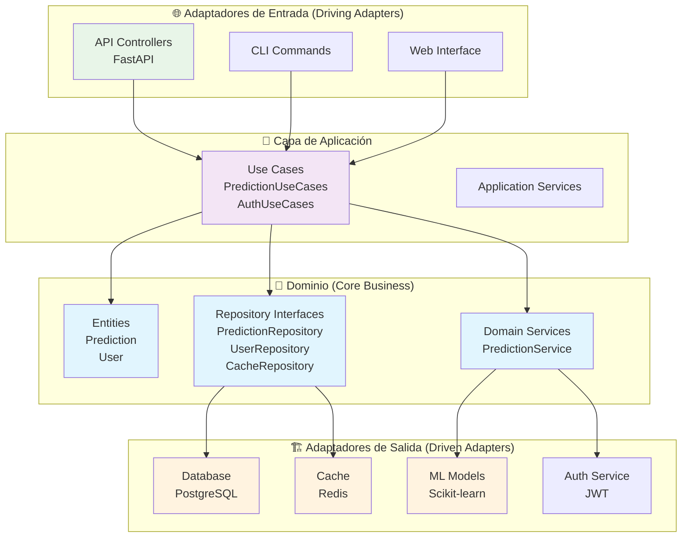
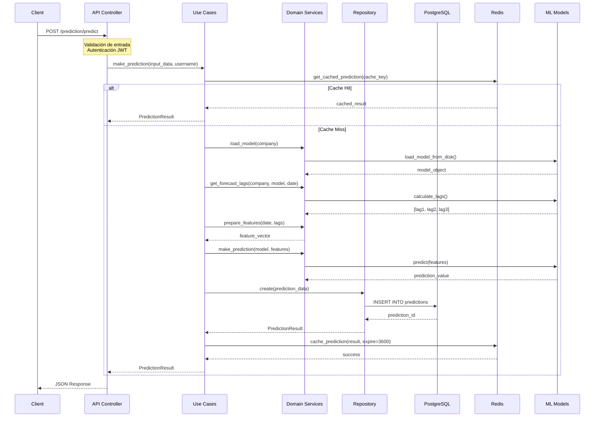
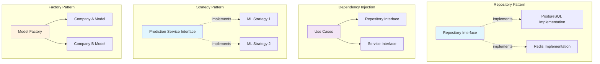
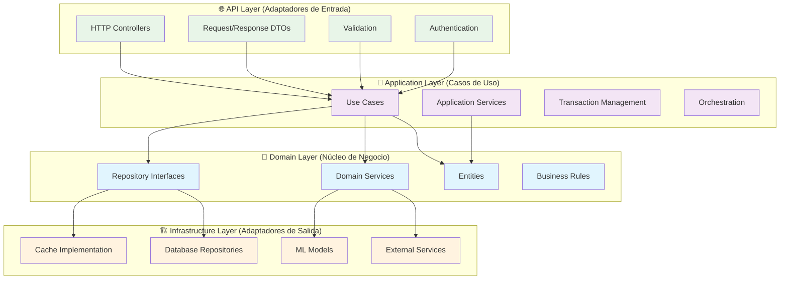
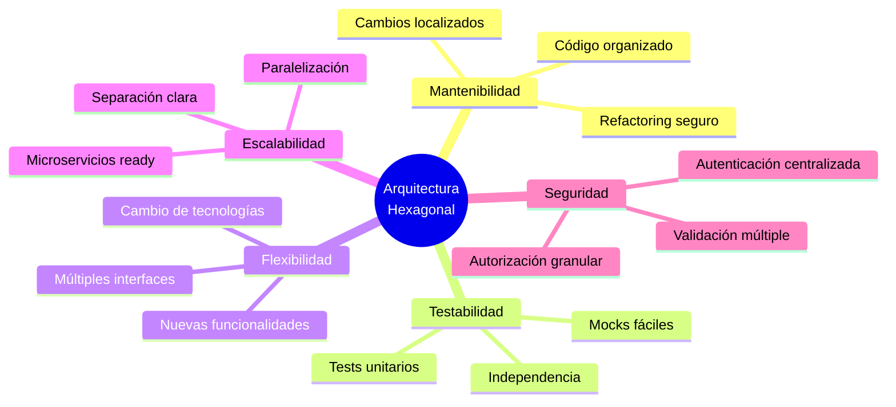
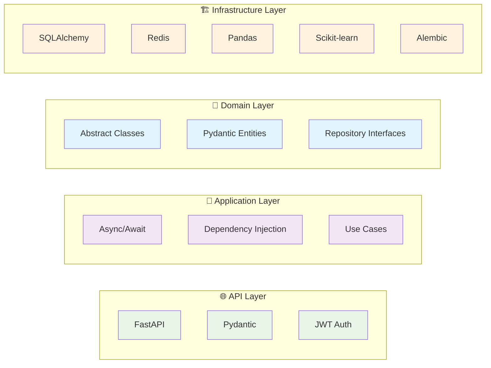

# Diagrama Visual de la Arquitectura Hexagonal

## Vista General de la Arquitectura



## Flujo Detallado de Predicción



## Estructura de Dependencias

```mermaid
graph LR
    subgraph "Dependencias Externas"
        FASTAPI[FastAPI]
        SQLALCHEMY[SQLAlchemy]
        REDIS[Redis]
        PANDAS[Pandas]
        SKLEARN[Scikit-learn]
    end
    
    subgraph "Infraestructura"
        INFRA[Infrastructure Layer]
    end
    
    subgraph "Aplicación"
        APP[Application Layer]
    end
    
    subgraph "Dominio"
        DOMAIN[Domain Layer]
    end
    
    subgraph "API"
        API[API Layer]
    end
    
    API --> FASTAPI
    INFRA --> SQLALCHEMY
    INFRA --> REDIS
    INFRA --> PANDAS
    INFRA --> SKLEARN
    
    API --> APP
    APP --> DOMAIN
    INFRA --> DOMAIN
    
    style DOMAIN fill:#e1f5fe
    style APP fill:#f3e5f5
    style INFRA fill:#fff3e0
    style API fill:#e8f5e8
```

## Patrones de Diseño Aplicados



## Capas y Responsabilidades



## Ventajas de la Arquitectura



## Tecnologías por Capa

